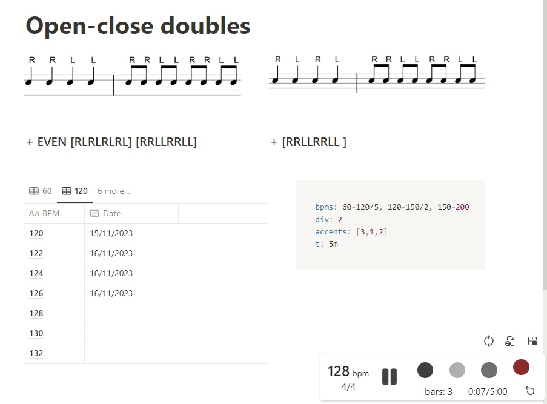

# Metronome trainer

Chromium-compatible extension (also tested on Android in Yandex browser).
Helps drummers and other musicians to exercise and track progress in Notion pages.
Use metronome to practice a task with current BPM.
Use BPM table to keep track of completed tasks.



## Getting started

It may take some time for the first time, but once you set it up, workflow becomes pretty efortless.

1. Login to [Notion](https://www.notion.so/).
2. Create an internal integration [here](https://www.notion.so/my-integrations).
3. Install the extension, open its options and paste the secret from created integration.
   The secret will be stored in browser cloud storage and will be used only to access official Notion API.
4. Create an exercise Notion page.
   1. Add a connection for the page to the created integration (Page menu -> Add connections).
      Easiest way is to create a "folder" page, connect only this page to the integration
      and store all the exercises as a nested pages.
      Do not connect your important private pages to the integration
      in order to reduce security and data loss risks.
   2. Add database to the page.
      1. Rename `Title` property to `BPM`.
      2. Add property `Date` of type `Date`.
      3. And property `nBPM` of type `Formula`,
         set formula value to `toNumber(prop("BPM"))`,
         hide the property from the view.
      4. Optionally create more views in the database with filter on `nBPM` value
         to split a single view to a few "pages".
   3. Add a code block, set language to `yaml` and use content like this:

      ```yaml
      bpms: 60-120/5, 120-150/2, 150-200
      bar: 4/4
      div: 2
      accents: [3,1,2,1]
      t: 1m
      ```

      This is exercise settings, change it as you need.
      All fields are optional, but you probably want to keep exercise duration (`t`).
      Also keep `bpms` in order to automatically fill your database in next steps.

5. You may need to reload the page in order for metronome to appear
   (it might have a delay due to Notion API speed).
   If there is no rows in your database yet, only buttons will appear in bottom-right corner.
6. Click to the button `Refill BPM table`.
7. Enjoy!

> :bulb: You can create a "template" page with configured database view and typical settings
> and duplicate it whenever you need to create a new exercise.

## Build

```cmd
node --version
corepack enable
yarn --version
yarn
yarn build
```

node version should be >= 18
yarn version should be >= 4

## Useful links

Metronome development:

- <https://meowni.ca/posts/metronomes/>
- <https://github.com/ctrager/metronome.html/blob/master/metronome.html> (<https://ctrager.github.io/metronome.html>)
- <https://webaudiodemos.appspot.com/metronome/index.html>
- <https://codepen.io/ganderzz/pen/poOQbJ>
- <https://seanwayland.github.io/waylonome/>

Speed control:

- <https://github.com/polywock/globalSpeed/tree/master>
- <https://transpose.video/>

Chrome extensions development:

- <https://github.com/chibat/chrome-extension-typescript-starter>

Notion:

- <https://github.com/dlyz/notion-embedded> (`https://dlyz.github.io/notion-embedded`)
