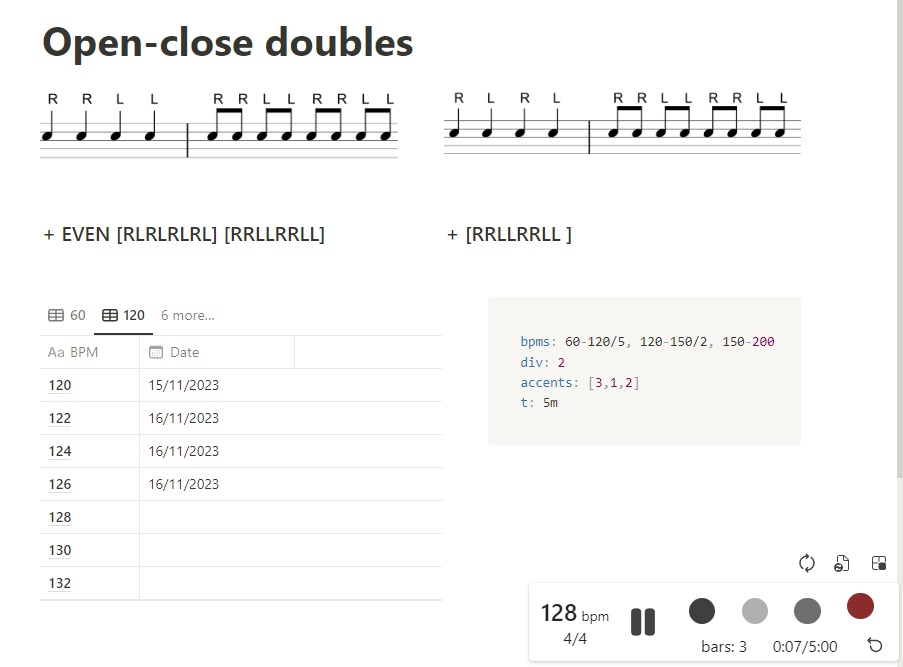

# Metronome trainer

Chromium-compatible extension (also tested on Android in Yandex browser).
Helps drummers and other musicians to exercise and track progress in Notion pages.
Use metronome to practice a task with current BPM.
Use BPM table to keep track of completed tasks.

See instructions to get started [here](https://www.notion.so/dlyz/Metronome-Trainer-252692a4825c4e9eac41538ae74fcfb2).



## Build

```cmd
node --version
corepack enable
yarn --version
yarn
yarn build
```

node version should be >= 18
yarn version should be >= 4

## Useful links

Metronome development:

- <https://meowni.ca/posts/metronomes/>
- <https://github.com/ctrager/metronome.html/blob/master/metronome.html> (<https://ctrager.github.io/metronome.html>)
- <https://webaudiodemos.appspot.com/metronome/index.html>
- <https://codepen.io/ganderzz/pen/poOQbJ>
- <https://seanwayland.github.io/waylonome/>

Speed control:

- <https://github.com/polywock/globalSpeed/tree/master>
- <https://transpose.video/>

Chrome extensions development:

- <https://github.com/chibat/chrome-extension-typescript-starter>

Notion:

- <https://github.com/dlyz/notion-embedded> (`https://dlyz.github.io/notion-embedded`)
